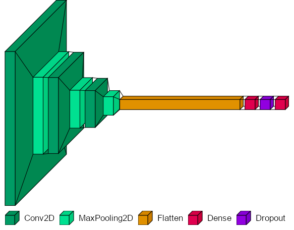

# EDMSorta: A Machine Learning Electronic Dance Music Subgenre Classification Model
### Author: Diego M. Fernández

## Overview | Background | Motivation

The classification of Electronic Dance Music (EDM) on a wide scale requires intimate knowledge of hundreds of niche sub-genres. Experts capable of characterizing any EDM song are incredibly difficult to find, so companies like Spotify need alternative methodologies. 

In this work, I tackle the solution of automating EDM sub-genre classification. I develop a machine learning model that establishes sub-genre classification proof of concept. This model uses a convolutional neural network (CNN) - a deep learning image classification model - and a dataset of 300 songs split across three genres: Big Room House, Drum and Bass, and Techno. The model performs with 49% accuracy on this three class dataset, suggesting potential for success going forward. In the future, larger datasets, alternative models, and increased computing power will likely prove instrumental in performance improvement. 

## Navigating This Repository

| Folder/File Name | Contents    |
| ----------- | ----------- |
| data | The dataset breakdown as csvs - please reach out to the author for full dataset |
| notebooks   | Notebooks developed throughout the project |
| grid_search_results | Model grid search results |
| images | Images used in the presentation and README.md  |
| research_papers  | The research papers this work uses for inspiration |
| venv  | Where the virtual environment parameters are stored in a YAML file |
| high_res_spectrograms_dataset_creation | The notebook creating the dataset and splits |
| model_gridsearch_visualization | The modeling, grid searching, and model visualization notebook |

## Data Breakdown

The data used in the development of this CNN consists of 300 2 minute segments of songs, split evenly across three sub-genres: Big Room House, Drum And Bass, and Techno. 

Audio files are converted into Mel-spectrograms, which use the Mel scale to closely mimic human auditory perception. These spectrograms plot the loudness of a given frequency at a given time in an audio file, as can be seen in the figure below. Frequency in Hz is on the y-axis, time in minutes and seconds is on the x-axis, and color indicates the loudness in decibels (see colorbar on right).

The CNN reads in these images, which have been partitioned into train, validation, and test sets according to a standard 70:15:15 split.

## Modeling and Evaluation

Model development consisted of beginning with a simple CNN architecture then improving hyperparameters, number of layers, and position of layers. Grid search was performed on the following hyperparameters: batch size, learning rate, activation, kernel size, and evaluation metric. These tests were applied to models with 2, 3, and 4 convolutional layers, testing out different image resolutions, decreasing learning rate for higher resolutions. 

#### Current Model Progression

| Model       | Description | Accuracy |
| ----------- | ----------- | ----------- |
| Baseline Model      | Random Guess | 33% |
| First CNN | 2 Convolutional Layers | 42.2% |
| Grid Search Best CNN | 3 Conv Layers w/ Optimized Hyperparameters | 48.89% |

### Model Architecture

The best performing CNN model contains 3 convolutional layers, 3 max pooling layers, 1 dropout layer, and 2 dense layers (as seen below).

#### Selected Hyperparamters

| Hyperparameter | Value |
| ----------- | ----------- |
| Batch Size | 16 |
| Learning Rate   | 0.0005 |
| Activation Function | ReLu |
| Kernel Size | (4, 4) |
| Optimizer  | Adam |
| Metric | Accuracy |
| No. Conv Layers | 3 |
| No. Pooling Layers | 3 |
| No. Conv Layers | 3 |
| No. Dense Layers | 2 |
| Dropout Ratio |  0.5 |

## Conclusion

The final model beats a random guess by 16% accuracy. This establishes proof of concept that CNNs can be used for the classification of EDM sub-genres. There is, however, room for improvement. The upcoming steps for further project development are ordered below.

### Steps to improve model robustness

1. Increase size of dataset. Aim for 500 songs per genres, then increase the number of genres used in classification.
2. Apply different deep learning architectures. ResNets will be used in the next phase
3. Fuse a random forest model that performs classification on song features, such as tempo, spectral spread, and song energy.

#

## Research Inspiration 
- Deep Learning Based EDM Subgenre Classification using Mel-Spectrogram and Tempogram Features
  - Authors: Wei Han Hsu, Bo-Yu Chen, Yi-Hsuan Yang
  - [Paper](https://arxiv.org/abs/2110.08862)
  - [GitHub](https://github.com/ddman1101/EDM-subgenre-classifier)
- Automatic Subgenre Classification in an Electronic Dance Music Taxonomy
  - Authors: Antonio Caparrini, Javier Arroyo, Laura Pérez-Molina, Jaime Sánchez-Hernández
  - [Paper](https://www.tandfonline.com/doi/full/10.1080/09298215.2020.1761399)
  - [GitHub](https://github.com/Caparrini/pyGenreClf)

## Data Source
The dataset used is courtesy of Antonio Caparrini, PhD candidate at Universidad Complutense de Madrid.
